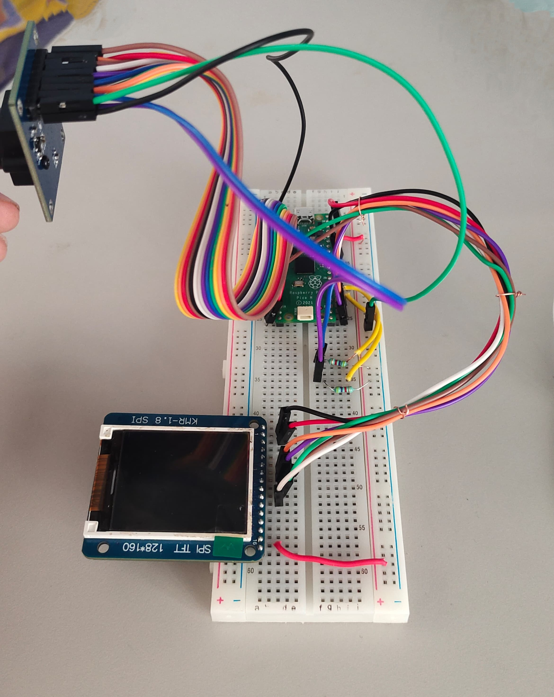

# Table of Contents

  -   [Creating a Handwritten Digit Classification System with Raspberry Pi Pico](#creating-a-handwritten-digit-classification-system-with-raspberry-pi-pico)
  - [Project Overview](#project-overview)
  - [Project Inspiration](#project-inspiration)
  - [Required Hardware](#required-hardware)
  - [Required Software](#required-software)
  - [Installation and Setup](#installation-and-setup)
  - [Running and Debugging](#running-and-debugging)
  - [Raspberry Pi Pico Pin Diagram](#Raspberry-Pi-Pico-Pin-Diagram)
  - [Wiring](#wiring)

# Creating a Handwritten Digit Classification System with Raspberry Pi Pico

## Project Overview

In this project, we aim to develop a system that uses a Raspberry Pi Pico to run a machine learning model. This model will analyze images captured by an OV7670 camera module and predict the handwritten digit present in the image. The result will be displayed on a 128x160 TFT LCD screen. The entire process, from image capture to digit classification, will be self-contained on the Raspberry Pi Pico. [YouTube link](https://youtube.com/shorts/z9YVKxLYIeM?feature=share)

## Project Inspiration

This project drew inspiration from [Handwritten digit classification using Raspberry Pi Pico and Machine Learning](https://ashishware.com/2022/09/03/pipico_digit_classification/). While the core idea remains similar, several necessary changes and enhancements have been made to adapt it to our specific requirements and goals.

## Required Hardware

1. **Raspberry Pi Pico**: This project is designed for the Raspberry Pi Pico, but it may work on other boards that support CircuitPython with some modifications. Ensure your board has sufficient GPIO pins, as almost 80% of the Pi Pico's GPIOs are used.

2. **128x160 TFT LCD**: You'll need a compatible LCD display. Other displays may work with code adjustments, but an LCD is essential for practical alignment of handwritten digits with the camera's view.

3. **OV7670 Camera Module**: This camera module is used for capturing images. It's an affordable option for this project.

4. **Full-sized breadboard (highly recommended)**: A breadboard facilitates connections between components.

5. **Jumper Cables**: You'll need male-to-female (M-F) and male-to-male (M-M) jumper cables for making various connections.

6. **4.7k ohm resistor (2)**: These resistors are part of the project's electronic setup.

## Required Software

1. **Any text editor**: You'll need a text editor for editing the code if necessary.

2. **A full Python distribution and pip**: These are required for training and exporting the machine learning model.

3. **Patience**: Building and fine-tuning this system may require some patience.

The project aims to display the classification results on the 128x160 TFT LCD, making it a practical and interactive solution. It leverages CircuitPython for its versatility, ensuring compatibility with various boards supporting CircuitPython.

## Installation and Setup

1. **Install CircuitPython on Your Board**: Start by installing CircuitPython on your Raspberry Pi Pico board.

2. **Download Necessary Library Files**: Visit the CircuitPython website to download the necessary library files. Alternatively, you can obtain these files from the website and paste them into the "lib" folder on your board.

3. **Copy Code Files**: Copy and paste the following files into your board:
   - `code.py`
   - `svm_min.py`

4. **Copy `arial.bdf` File**: Copy the `arial.bdf` font file to your board. This file is essential for displaying text on the LCD screen.

This step ensures that you have all the required files in place for running your project successfully.

## Running and Debugging

To run and debug your code, follow these steps:

1. Use an Integrated Development Environment (IDE), preferably Thonny IDE.

2. Ensure that your Raspberry Pi Pico is connected to your computer.

3. Refer to the connection details provided below for proper setup and debugging.

Please note that you'll need to configure your IDE to work with your Raspberry Pi Pico for effective code development and debugging.

## Raspberry Pi Pico Pin Diagram

## Wiring

For this project, a substantial amount of wiring is required. It is highly recommended to use breadboards and jumper cables for a clean and organized setup.

### LCD Connections

| Display Pin Number | Display Pin Name | Pi Pico Pins |
|-------------------|------------------|--------------|
| 2                 | VCC              | 5V (VBUS)        |
| 1                 | GND              | GND          |
| 10                | CS               | GP18         |
| 6                 | RESET            | GP17         |
| 7                 | A0               | GP16         |
| 8                 | SDA              | GP11         |
| 9                 | SCL              | GP10         |
| 15                | LED +            | 3.3V         |

### OV7670 Module Connections

| OV7670 Pin Name | Pi Pico Pin Name                    |
|-----------------|------------------------------------|
| D0              | GP0                                |
| D1              | GP1                                |
| D2              | GP2                                |
| D3              | GP3                                |
| D4              | GP4                                |
| D5              | GP5                                |
| D6              | GP6                                |
| D7              | GP7                                |
| PCLK            | GP8                                |
| MCLK            | GP9                                |
| HS              | GP12                               |
| VS              | GP13                               |
| PDWN            | GP15                               |
| RESET           | GP14                               |
| SCL             | GP21 (via 4.7k external pull-up resistor) |
| SDA             | GP20 (via 4.7k external pull-up resistor) |
| 3.3V            | GP36                               |
| GND             | GND                                |

## Wrapping It Up

In this project, we set out to turn our Raspberry Pi Pico into a handwriting detective. We wanted it to look at handwritten digits through its trusty OV7670 camera, figure out what they were, and proudly display the results on its 128x160 TFT LCD screen.

Our inspiration came from [Handwritten digit classification using Raspberry Pi Pico and Machine Learning](https://ashishware.com/2022/09/03/pipico_digit_classification/), but we put our own spin on it. We had to pick the right gear, get those wires connected just right, and make sure we had all the software bits in place. Don't forget the `arial.bdf` font file – it's the unsung hero that made text pop on the screen!

The coolest part? Our Raspberry Pi Pico pulled off the whole show by itself. No fancy computers or clouds needed. It's a testament to what these tiny machines can do when we get creative.

As we wrap things up, we hope this project sparks your imagination. Maybe you'll find your own way to combine microcontrollers, machine learning, and cool displays to bring your ideas to life. Remember, with a dash of patience and a sprinkle of determination, you can make some seriously awesome stuff. 
